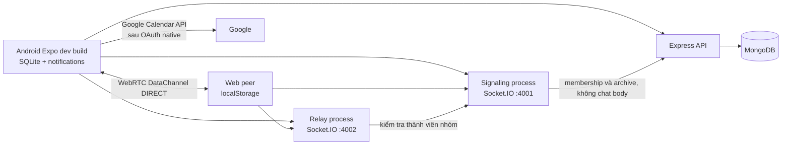

# Kiến trúc và các giai đoạn

Signaling chỉ chuyển `request`, `offer`, `answer`, `ice`, đăng ký, presence và dữ liệu nhóm/quyền; không nhận chat envelope. Relay chuyển envelope khi mode `RELAY` và ghi `FORWARD messageId`. API xử lý dữ liệu Mobile và cung cấp membership/archive cho signaling, không nhận hoặc lưu chat body. Android dùng user Mongo `_id` làm Peer ID; web demo dùng ID tự đặt và secret lưu trình duyệt. JWT của API chứng thực Android ở signaling; token ngắn hạn do signaling cấp chứng thực kết nối relay.

### Vì sao chọn DataChannel + relay ứng dụng

Hai máy có NAT thường không thấy địa chỉ riêng của nhau. ICE dùng STUN để tìm địa chỉ ứng viên; nếu cặp ứng viên hoạt động, DataChannel gửi trực tiếp qua kết nối WebRTC được mã hóa. Một số NAT/firewall không cho kết nối trực tiếp. TURN là relay ở tầng WebRTC/ICE, có thể giúp ICE nối được nhưng cần máy chủ TURN và băng thông riêng. Dự án **không triển khai TURN**. Khi DataChannel không mở trong 5 giây hoặc bị mất, client đổi sang relay Socket.IO do nhóm viết. Relay này đọc envelope ở tầng ứng dụng và khác TURN. Tham khảo [MDN WebRTC protocols](https://developer.mozilla.org/en-US/docs/Web/API/WebRTC_API/Protocols) và [DataChannel](https://developer.mozilla.org/en-US/docs/Web/API/WebRTC_API/Using_data_channels).

### Các giai đoạn và tiêu chí

1. **Mốc native sớm:** cấu hình Expo development build + `react-native-webrtc`, build APK trên máy có Android SDK, hai peer cùng Wi-Fi mở DataChannel và lưu log DIRECT. Repo có cấu hình, nhưng mốc thiết bị thật chưa thể xác nhận trong môi trường này.
2. **Nền tảng DS01:** hai process độc lập, schema, discovery/heartbeat, relay auth/routing, nhóm, ACK/retry/dedupe; test tự động chạy qua.
3. **Mobile:** API Mongo, màn hình đăng nhập, lịch tổng hợp, dự án/task/thảo luận/tài liệu/ngân sách, SQLite và nhắc deadline/sự kiện. Sau đăng nhập app mở lịch tổng hợp; các phép tính lịch Việt Nam có test thuần, còn luồng notification cần kiểm tra lại trên Android.
4. **Tích hợp:** Android/web dùng PeerClient chung, nhóm dự án ánh xạ `chatGroupId`; cần thử ba peer thật, mất kết nối và restart.
5. **Kiểm chứng:** lint/typecheck/test/web build và demo 2 mạng/Google OAuth; phần máy phát triển đã chạy, các ca còn lại ghi ở `test-plan.md`.

### Dữ liệu và giới hạn

`Project.members` là ACL cho REST API. `Task.version` dùng compare-and-swap khi cập nhật đồng thời, trả 409 để người dùng tải lại. Task mới có `startsAt` và `dueAt`, trong đó `dueAt` là thời điểm kết thúc/deadline dùng cho nhắc hạn và phân loại sắp quá hạn/quá hạn. API kiểm tra `startsAt < dueAt` khi có đủ hai mốc. `startsAt` là tùy chọn ở tầng dữ liệu để vẫn đọc được task cũ chỉ có `dueAt`; form Android tạo/sửa task yêu cầu hai mốc và mở popup native chọn ngày rồi giờ cho từng trường. `Event.project = null` biểu diễn sự kiện cá nhân; nếu có `project` thì đó là sự kiện dự án. Mỗi sự kiện lưu `createdBy`, tiêu đề, thời gian, ghi chú, trạng thái cả ngày và các mốc nhắc hợp lệ 1 tuần/1 ngày/1 giờ.

Chat cá nhân có service riêng, dùng lại PeerClient của Group Chat. `GET /contacts` trả danh bạ người cùng dự án, không phải cơ chế kết bạn; `peer:lookup` query một Peer ID trên signaling. Tin cá nhân có `groupId` null/undefined, gửi qua `sendDirect` và dùng DIRECT/RELAY/ACK giống nhóm. SQLite bổ sung `group_id` nullable, migration backfill từ payload cũ và checkpoint; `listDirect` lọc scope cùng đúng cặp A/B để không trộn lịch sử nhóm. Web giữ key localStorage cũ và áp dụng cùng predicate. Android có tab `Tin nhắn` độc lập với tab Chat nhóm của dự án: danh bạ lấy từ REST, trạng thái lấy từ signaling, lịch sử đọc SQLite và composer chỉ bật khi người nhận online. Danh bạ không thay ACL của transport P2P hiện có. Xem [direct-chat.md](direct-chat.md).

`GET /calendar` trả một feed gồm task có deadline được phân công cho người hiện tại từ mọi dự án họ tham gia, sự kiện cá nhân của họ và sự kiện từ các dự án mà họ là thành viên. Tham số `from`/`to` tùy chọn giới hạn khoảng thời gian. Các lệnh ghi `POST /events`, `PATCH /events/:eventId`, `DELETE /events/:eventId` xử lý cả sự kiện cá nhân và dự án; JWT quyết định người dùng, nên client không được tự đặt `createdBy`. Sự kiện dự án còn được kiểm tra theo `Project.members`.

Android mở lịch tổng hợp ngay sau đăng nhập và vẫn cung cấp lịch riêng trong từng dự án. Các helper lịch dùng `Asia/Ho_Chi_Minh`, hiển thị `dd/MM/yyyy`, căn tuần từ thứ Hai và sinh hàng tiêu đề `T2` đến `CN`. SQLite giữ ID thông báo cục bộ cho task và sự kiện. Khi deadline, thời gian sự kiện, trạng thái hoặc mốc nhắc thay đổi, app đối chiếu chữ ký dữ liệu, hủy thông báo cũ và tạo lại; khi mục bị xóa, app hủy các ID còn lưu. Đây là nhắc cục bộ, không phải push từ server.

Lịch tổng hợp có ba phạm vi cố định: `all` (`Tất cả`), `personal` (`Cá nhân`) và `projects` (`Dự án`). `projects` lọc mọi mục có tham chiếu dự án, không sinh một bộ lọc riêng cho từng dự án. Chính sách thao tác cho phép tạo sự kiện ở `all` và `personal`, không cho tạo task ở lịch tổng hợp, đồng thời tắt cả hai thao tác tạo ở `projects` và ở lịch có `fixedProjectId`. Card gắn dự án chỉ điều hướng bằng `Xem / sửa` tới màn hình dự án và tab tương ứng; lịch trong dự án không phải điểm tạo mới. Các quy tắc này nằm trong `calendarPolicy.ts` để có thể kiểm thử độc lập với React Native.

Header `Hiển thị` của lịch chính và header ngữ cảnh của dự án được render ngoài `ScrollView` nội dung. Thanh dự án giữ nút quay lại, tên dự án, mục đang mở và nút `☰`; bấm nút mở Navigation Drawer dọc. Các tác vụ không còn nằm trên hàng tab ngang. Tab Tài liệu được bỏ; tải tệp mới qua bài Thảo luận và vẫn xem được tệp cũ.

Đồng bộ Google là một chiều từ feed lịch hiện tại: task chưa hoàn thành được giao cho người dùng cùng sự kiện cá nhân/dự án được upsert vào lịch chính bằng khóa ổn định. Mã tránh tạo trùng khi đồng bộ lại nhưng không tự xóa mục cũ trên Google. OAuth và đồng bộ với tài khoản thật vẫn chưa được kiểm thử khi chưa có credential của nhóm.

Nguồn lực/chi phí lưu số liệu tổng, không có thanh toán. Tài liệu lưu `Buffer` trong Mongo, Multer giới hạn 512 KiB/tệp, tối đa 3 tệp/bài và kiểm tra quyền cả dự án lẫn bài bị ẩn. SQLite lưu tin theo scope Peer ID; lúc khởi động app tải lại lịch sử. Nhóm demo signaling vẫn giữ RAM; nhóm dự án có UUID và membership lưu Mongo nên restart signaling đọc lại đúng nhóm. Relay kiểm tra ACL nhóm qua endpoint nội bộ signaling với shared secret; nhóm không giao offline.

### Phân cấp và transaction

`Project.kind` phân biệt độc lập/phân cấp; `parentProject` biểu diễn tổng → con, chưa có tầng cháu. `project_members` lưu vai trò theo từng dự án. `projectAccess.ts` kiểm tra membership cả tổng và con, tính quyền theo role và trạng thái lưu trữ hiệu lực. Giám đốc truy cập tất cả con; tổng quan của người khác chỉ gộp con được phép xem. `effectiveStatus = overdue` là giá trị tính từ deadline, không thay trạng thái nghiệp vụ đã lưu.

Các phép đổi member/manager/archive và ghi task/bài/bình luận/lịch dự án dùng Mongo transaction. Ghi version của tổng và con trong transaction làm các thao tác ghi xung đột với lưu trữ hoặc loại thành viên; callback kiểm tra lại quyền trong mỗi retry. Task dùng version, bài/bình luận dùng revision để trả 409 khi sửa trên bản cũ. Xóa thành viên bỏ / chuyển phân công và thay quản lý trong cùng commit. MongoDB phải là replica set; Compose local cấu hình `rs0`, Atlas giữ URI hiện tại.

`comments` lưu bình luận; `notifications` lưu hộp thư theo user/project, không có push server. Người tạo hành động được loại khỏi danh sách nhận. Deadline scanner tạo inbox theo task + dueAt để chống trùng. Nhắc Android 1 tuần / 1 ngày / 1 giờ vẫn là lịch cục bộ, có cơ chế hủy/cập nhật riêng. Chi tiết vai trò, endpoint và migration nằm trong [hierarchical-projects.md](hierarchical-projects.md).

### Triển khai

Local: MongoDB replica set trên `127.0.0.1:27017`, API 4000, signaling 4001, relay 4002, web Vite 5173. Internet: đặt bốn hostname HTTPS trong Caddyfile mẫu, chạy mỗi dịch vụ bằng lệnh riêng hoặc supervisor; build web bằng `npm run build -w @ds01/web-peer` rồi sửa đường dẫn `root` trong Caddyfile. Đặt `JWT_SECRET`, `PEER_SECRET` mạnh, khác nhau và tối thiểu 32 ký tự; process production sẽ từ chối secret thiếu/ngắn. Đặt `API_INTERNAL_URL` và `SIGNAL_INTERNAL_URL` nội bộ; Caddy mẫu chặn `/internal/*` từ bên ngoài. MongoDB chỉ nghe loopback/private network. Trên Android điền URL HTTPS trước khi chạy Metro/build. Có thể dùng Quick Tunnel không tài khoản để thử nghiệm ngắn hạn; mỗi process cần một URL tunnel và cần cập nhật `.env` sau khi tunnel cấp URL. Quick Tunnel đưa cả cổng ra ngoài, nên nhóm cần chặn các route nội bộ qua proxy khi triển khai. [Cloudflare nói Quick Tunnel chỉ dành cho thử nghiệm, không có SLA](https://developers.cloudflare.com/cloudflare-one/networks/connectors/cloudflare-tunnel/do-more-with-tunnels/trycloudflare/).
